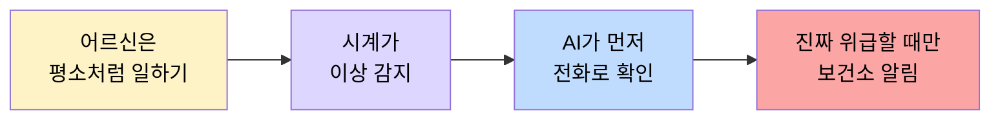
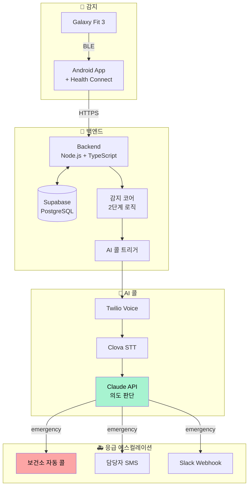
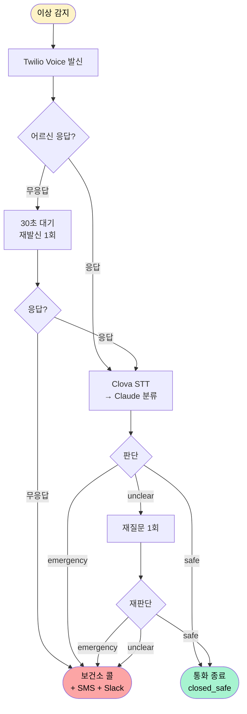

# Hero
## 농어촌 어르신을 위한 응급 모니터링 & AI 콜 시스템

> 농어촌 어르신의 응급 상황을 가장 빠르게 알아채는 안전망.  
> **심박 이상 감지부터 보건소 알림까지 — 골든타임 8분.**

<br/>

## 🧭 프로젝트 개요

Galaxy Fit 3 웨어러블로 농업인의 심박·걸음수를 상시 수집하고, 2단계 이상 감지 로직으로 위험 신호를 포착합니다. 위험으로 판단되면 AI가 자동으로 전화를 걸어 어르신과 음성으로 대화하고, 응답을 분석해 **진짜 위급한 상황만** 보건소로 전달합니다.

- 🏫 **이화여자대학교 2026학년도 1학기 소셜벤처창업 수업**
- 🤝 **카카오–테크포임팩트 연계 프로젝트**
- 📍 **대상 지역**: 경북 청도 다로리

<br/>

## 🚨 문제의식

농어촌 어르신은 혼자 일하는 시간이 많고, 응급 상황이 발생해도 도움이 도착하기까지 시간이 오래 걸립니다.

| 환경 | 응급의료센터 도달 시간 | 골든타임 대응 |
|---|---|:---:|
| 도시 (서울·광역시) | 5~15분 | ✅ |
| 일반 농어촌 평균 | 30~60분 | ⚠️ |
| 청도 다로리 (본 프로젝트) | 5분 진입권 | ✅* |

> *단, **감지·연결이 늦으면** 거리상 가까운 의료센터도 무용. 어르신이 쓰러진 줄 **아무도 모르면** 골든타임은 무너집니다.

**Hero의 목표는 "감지부터 보건소 도달까지 최대 8분 이내"** 를 시스템적으로 보장하는 것입니다.

<br/>

## 💡 핵심 가치



- **무조작 운영** — 어르신은 시계만 차면 됨. 앱 조작 없음
- **2단계 감지로 오탐 최소화** — 심박 이상 + 무활동 전환을 모두 만족해야 위험 판단
- **AI 콜 1차 필터링** — 진짜 응급 케이스만 보건소로 전달, 인력 부담 최소화

<br/>

## 🔬 시스템 구조



<br/>

## 📐 2단계 이상 감지 로직

> 농업 환경 특수성(고온 노출, 장시간 노동, 외딴 작업장)을 고려해 두 가지 트리거를 병렬 운영합니다.

### A. 심박 상승 트리거 — 열사병 / 열탈진 의심

| 단계 | 조건 | 지속 | 후속 |
|---|---|---|---|
| 1단계 (심박) | 개인 기준선 대비 **50% 이상 상승** | 5분 이상 | 2단계 진입 |
| 2단계 (무활동) | **걸음수 = 0** | 즉시 | 분기 관찰 진입 |
| 분기 A-1 (`safe_rest`) | 2분 이내 심박 기준선 이내로 회복 | 2분 관찰 | 알림 없음 |
| 분기 A-2 (`heatstroke`) | 2분 지나도 심박 기준선 바깥 | 2분 관찰 | **AI 전화 + 알림** |

### B. 심박 급락 트리거 — 미주신경성 실신 의심

| 단계 | 조건 | 지속 | 후속 |
|---|---|---|---|
| 1단계 (심박) | 개인 기준선 대비 **30% 이상 급락** | 즉시 | 분기 관찰 진입 |
| 분기 B-1 (`safe_rest`) | 2분 이내 회복 | 2분 관찰 | 알림 없음 |
| 분기 B-2 (`syncope`) | 2분 지나도 기준선 바깥 | 2분 관찰 | **AI 전화 + 알림** |


> **기준선 정책**: 앱 최초 설치 시 과거 7일 심박 데이터로 개인 기준선 산출. 신규 사용자는 임시 75bpm으로 7일 운영 후 자동 갱신.

<br/>

## 📞 AI 콜 분기



### 통화 분기 처리

| 판단 | AI 멘트 | 처리 |
|---|---|---|
| `safe` | "다행이에요. 심박이 높아서 걱정했어요. 오늘도 건강하고 안전하게 일하세요!" | 통화 종료, `closed_safe` 로그 |
| `emergency` | "알겠습니다. 지금 바로 도움을 요청하겠습니다. 잠시만 기다려 주세요." | 보건소 SMS + 대시보드 + GPS |
| `unclear` (1차) | "죄송해요, 잘 못 들었어요. 다시 한 번 여쭤보겠습니다." | 재질문 1회 |
| `unclear` (2차) | "다시 질문했으나 답을 확인할 수 없습니다. 도움을 요청할게요." | `emergency` 처리 |
| 무응답 (1회) | (재발신, 동일 멘트) | 30초 후 재발신 |
| 무응답 (2회) | "연락이 닿지 않아 도움을 요청할게요." | 보건소 자동 알림 + GPS |

### Claude 분류 기준

- **`safe`** — "괜찮아요", "별일 없어", "그냥 넘어졌어", "쉬고 있어" 등 명확한 안전 표현
- **`emergency`** — "아파요", "못 일어나", "어지러워", "도와줘", "119" 등 통증·호흡곤란·쓰러짐·혼란 상태
- **`unclear`** — 단음절 반복("응..", "어.."), 침묵·웅얼거림, 상황 파악 불가("뭐야"), 맥락 벗어남

> **`safe` + `emergency` 신호 동시 존재 시 `emergency` 우선** — 안전 최우선 원칙.

<br/>

## 🛠 기술스택

### Mobile (Android)

| 역할 | 종류 |
|---|---|
| Framework |  |
| Language |  |
| Health Data |  |
| Background |  |
| Location |  |

### Dashboard (PC)

| 역할 | 종류 |
|---|---|
| Framework |  |
| Language |  |
| Map |  |

### Backend

| 역할 | 종류 |
|---|---|
| Runtime |  |
| Framework |  |
| Language |  |
| DB |   |

### AI / Communication

| 역할 | 종류 |
|---|---|
| Voice Call |  |
| STT (Korean) |  |
| Intent Classification |  |
| SMS |  |

### External API

| 역할 | 종류 |
|---|---|
| Geocoding |  |
| Weather |  |

### Infra / Deploy

| 역할 | 종류 |
|---|---|
| Backend Deploy |  |
| Frontend Deploy |  |
| Version Control |   |

### Common

| 역할 | 종류 |
|---|---|
| Design |  |
| Docs / PM |  |
| Wearable |  |

<br/>

## 🗓 개발 로드맵

### Phase 1 — MVP ✅ (코드 구현 완료, 실기기 테스트 진행 중)

- [x] Backend: `/health`, `/alert`, `/users/register` API
- [x] Backend: 2단계 이상 감지 로직 (심박 상승 + 심박 급락 분기)
- [x] Backend: 환경 가중치 (체감온도 33°C↑ 시 관찰 1분 단축)
- [x] Backend: AI 콜 (Twilio + Clova STT + Claude `safe`/`emergency`/`unclear`)
- [x] Backend: 보건소 자동 콜 + SMS
- [x] Mobile: ForegroundService + Health Connect + 서버 연동 (코드)
- [x] Mobile: 앱 최초 설치 시 과거 7일 심박 데이터 연동 (코드)
- [x] Mobile: GPS 위치 수집 — 정상 5분 / 이상 감지 후 30초 (코드)
- [x] PC 대시보드: 농업인 목록 + 알림 이력 + 개인 상세
- [x] 배포: Railway (백엔드) + Vercel (대시보드 + 모바일 웹)
- [ ] Android 빌드 환경 구축 + 실기기 테스트
- [ ] E2E 테스트 수행

### Phase 2 — 안정화

- [x] 기상청 API 연동
- [x] 카카오맵 역지오코딩 연동
- [x] 알림 이력 조회 + 오탐 처리 로직
- [x] 대상자 등록/관리 화면
- [ ] 기준선 주간 자동 갱신
- [ ] 통계 화면

### Phase 3 — 고도화 (검토 중)

- [ ] AI콜 음성을 가족 목소리로 변환 (Voice Cloning)
- [ ] Samsung Health SDK 직접 연동 (실시간성 향상)
- [ ] 관리자 대시보드 실시간 WebSocket
- [ ] 보호자 앱 role 추가 (위치 공유 + 알림)

<br/>

## 🌐 배포 현황

| 서비스 | 플랫폼 | URL | 상태 |
|---|---|---|---|
| 백엔드 API |  | `daro-reporter-production.up.railway.app` | ✅ Live |
| 관리자 대시보드 |  | https://daro-reporter.vercel.app | ✅ Live |
| 모바일 웹앱 |  | https://daro-reporter-mobile.vercel.app | ✅ Live |

<br/>

## 🗂 MVP에서 의도적으로 잘라낸 것

| 잘라낸 것 | 대체 방안 |
|---|---|
| 사용자별 기준선 자동 갱신 (주간) | 설치 시 1회 산출 후 고정, 신규는 75bpm 7일 후 갱신 |
| 관리자 대시보드 실시간 WebSocket | PC 대시보드(폴링) + SMS 병용 |
| Samsung Health SDK 직접 연동 | Health Connect 경유 |
| Redis | in-memory + Supabase row 처리 |
| Slack Webhook | 사용하지 않기로 결정 |

<br/>

## 📁 저장소 구조

```text
daro-reporter/
├── backend/                 # Node.js + Express + TypeScript
│   ├── src/
│   │   ├── api/             # /health, /alert, /users 엔드포인트
│   │   ├── detection/       # 2단계 감지 로직 + 기준선 계산
│   │   ├── state/           # 사용자 상태머신 (normal → alert)
│   │   ├── ai-call/         # Twilio 발신 + Clova STT + Claude 분류
│   │   ├── notify/          # SMS + 보건소 콜
│   │   ├── external/        # 기상청 API + 카카오맵 API
│   │   └── db/              # Supabase 클라이언트 + schema.sql
│   └── scripts/             # test-call.ts 등 유틸
│
├── mobile/                  # React Native + TypeScript (Android + Web)
│   ├── src/
│   │   ├── screens/         # 온보딩, 홈, 설정
│   │   ├── services/        # Health Connect, GPS, Background, DataSync
│   │   ├── hooks/           # useHealthData, useUser
│   │   ├── api/             # 서버 통신 클라이언트
│   │   └── mocks/           # 웹 버전용 mock
│   └── App.web.tsx          # 웹 버전 엔트리
│
├── dashboard/               # PC 관리자 대시보드 (React + TypeScript)
│   └── src/
│       ├── pages/           # 농업인 목록, 알림 이력, 개인 상세, 등록
│       └── components/      # 레이아웃, 카카오맵 뷰
│
├── docs/                    # 프로젝트 문서
│   ├── 현황_0526.md         # 현재 진행 상황 (최신)
│   ├── 진행_보고서.md
│   ├── Android_빌드_가이드.md
│   └── legacy/             # 이전 문서 아카이브
│
└── README.md
```

<br/>

## 🌿 브랜치 전략

```
main ← 안정 버전 (배포 기준)
 └── dev ← 통합 개발 (PR 타겟)
      ├── feat/backend/#이슈번호-설명     (백엔드 API · 감지 코어)
      ├── feat/ai-call/#이슈번호-설명     (Twilio · Clova · Claude)
      ├── feat/android/#이슈번호-설명     (헬스 데이터 · GPS)
      ├── feat/dashboard/#이슈번호-설명   (PC 대시보드)
      └── fix/#이슈번호-설명
```

<br/>

## 🚀 빠른 시작

```bash
git clone https://github.com/ryeong03/daro-reporter.git
cd daro-reporter
```

| 앱 | 개발 서버 | 빌드 |
|---|---|---|
| Backend | `cd backend && npm install && npm run dev` | `npm run build` |
| Dashboard | `cd dashboard && npm install && npm start` | `npm run build` |
| Mobile (Web) | `cd mobile && npm install && npm run web` | `npm run build:web` |

> 상세 환경변수 설정은 `docs/legacy/API키_설정가이드.md` 참고

<br/>

## 🔑 환경 변수

```bash
# Supabase
SUPABASE_URL=
SUPABASE_SERVICE_ROLE_KEY=

# Twilio (Voice + SMS)
TWILIO_ACCOUNT_SID=
TWILIO_AUTH_TOKEN=
TWILIO_PHONE_NUMBER=
HEALTH_CENTER_PHONE=

# Clova Speech (Naver Cloud Platform)
CLOVA_SPEECH_INVOKE_URL=
CLOVA_SPEECH_SECRET=

# Claude
ANTHROPIC_API_KEY=

# 외부 API
KMA_API_KEY=
KAKAO_MAP_API_KEY=
```

<br/>

## 👥 팀

**팀명:** Hero · **트랙:** 소셜벤처창업 · **연계:** 카카오–테크포임팩트

|  |  |  |  |  |
|:--:|:--:|:--:|:--:|:--:|
| **박세령** | **임현진** | **이주영** | **박채린** | **Joonghyuk Kim** |
| AI 콜 + 백엔드 | 헬스 데이터<br/>(Android + Health Connect) | UI/UX 디자인 | 헬스 데이터<br/>(Android + Health Connect) QA + 고도화 (Phase 2~3) | 외부 API 연동<br/>(카카오맵 + 기상청) |
| [@ryeong03](https://github.com/ryeong03) | [@celinalab](https://github.com/celinalab) | [@Weeny326](https://github.com/Weeny326) | [@cheryn5555-prog](https://github.com/cheryn5555-prog) | [@jzikim](https://github.com/jzikim) |

<br/>

## 📚 참고 문서

### 기획·정책
- [AI 콜 구조 판단 기준 policy (주영)](https://www.notion.so/AI-policy-_-36a6e68639778063b61be3ebe65ce36b)
- [스레시홀드 정의 (채린)](https://www.notion.so/_-36a6e68639778054aa59dbe7febf2922)
- [기능명세서 템플릿](https://www.notion.so/3686e686397780ba99a6d069eb2ed909)
- [Userflow (Figma)](https://embed.figma.com/board/ShQqOIRGdtb1uX6QeY5IJy/IA-Userflow)

### 기능 명세 (페이지별)
- [농업인 - 앱 (관리)](https://www.notion.so/36a6e68639778034b4f0c62681d94813)
- [관리자 - 대시보드 (PC)](https://www.notion.so/PC-36a6e686397780609187fdd08e5b5c07)
- [관리자 - 알림](https://www.notion.so/36a6e68639778088a76cf9a0e2e2a9ee)
- [통신 명세](https://www.notion.so/36a6e6863977801aab63d1f750abcf6e)

### 기술 레퍼런스
- [Twilio Voice API 한국어 가이드](https://jjeongil.tistory.com/3150)
- [Twilio 전화솔루션 구축 (Java Spring, 참고용)](https://compogetters.tistory.com/m/entry/javaspringtwilio를-이용해서-전화솔루션-구축하기-비상연락망)
- [Clova Speech (NCP)](https://www.ncloud.com/product/aiService/clovaSpeech)
- [Health Connect (Android)](https://developer.android.com/health-and-fitness/guides/health-connect)

<br/>

<div align="center">
<sub>이화여자대학교 2026학년도 1학기 · 소셜벤처창업 · 카카오–테크포임팩트</sub>
</div>
