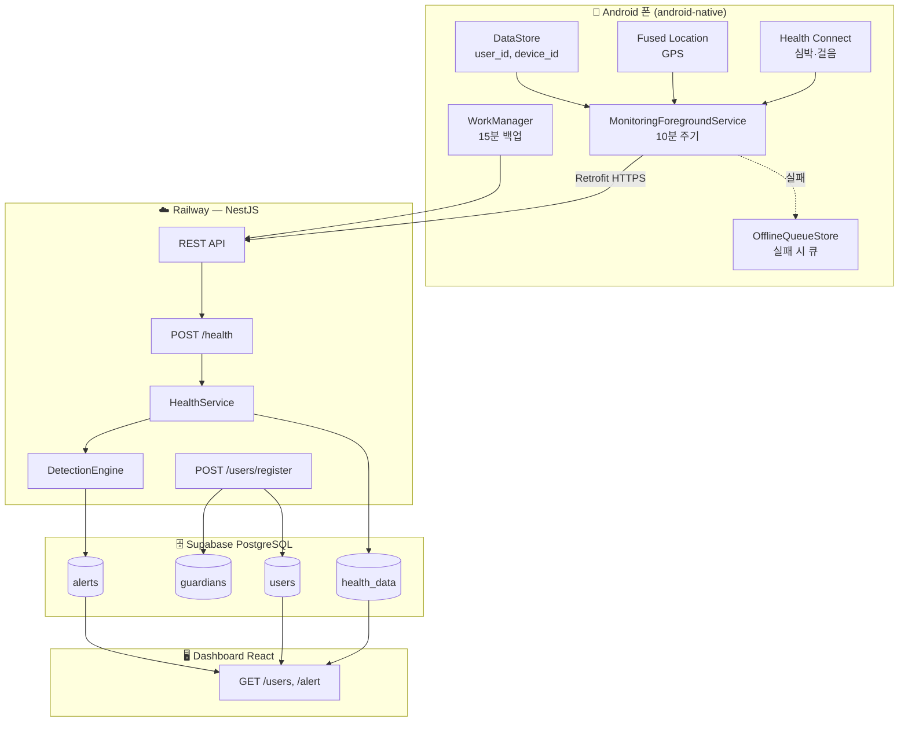
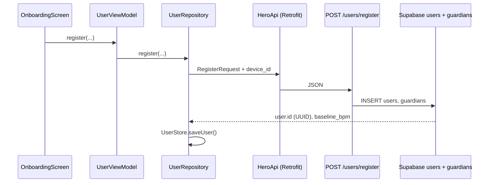
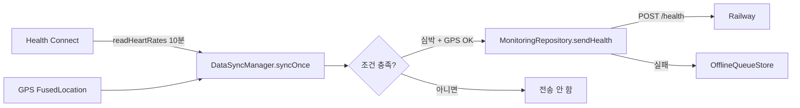
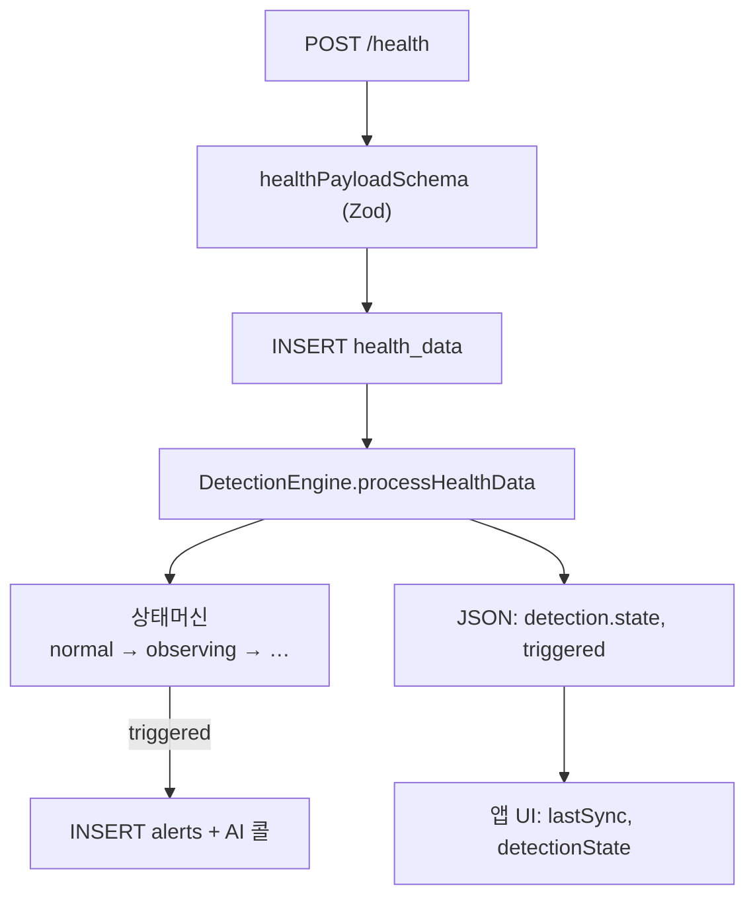
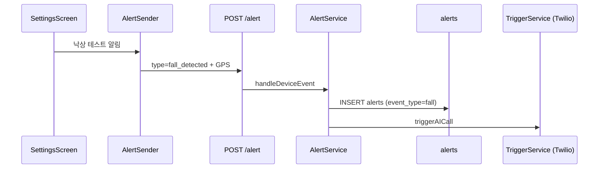
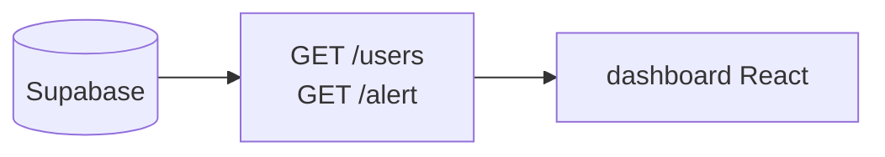

# Hero 데이터 파이프라인

> 폰(Android)에서 수집된 심박·걸음·GPS가 **어떤 코드를 타고**, **어느 서버·DB에 저장되는지** 정리한 문서입니다.  
> API 계약: [`openapi.yaml`](../openapi.yaml) · DB 스키마: [`DB_스키마_구조.md`](./DB_스키마_구조.md)

---

## 한눈에 보기



| 구간 | 기술 |
|------|------|
| **프로덕션 API** | `https://daro-reporter-production.up.railway.app` |
| **앱 설정** | `android-native/.../data/ApiClient.kt` |
| **DB** | Supabase Postgres (`backend/src/database/schema.sql`) |

---

## 클라이언트

| 앱 | 경로 | 비고 |
|----|------|------|
| **android-native** (Kotlin + Compose) | `android-native/` | 현재 농업인 앱 |
| **mobile** (React Native) | `mobile/` | 동일 API, 참고용 |
| **dashboard** (React) | `dashboard/` | DB 조회용 (쓰기 없음) |

---

## 폰에서 “누구 데이터인지” 식별

| 필드 | 생성 시점 | 저장 위치 (폰) | 용도 |
|------|-----------|----------------|------|
| `device_id` | 등록 시 `hero-{timestamp}` | DataStore `hero_user` | 기기/워치 식별 |
| `user_id` | 서버 UUID 발급 후 | DataStore | 모든 API의 주체 |
| `phone` | 온보딩 입력 | DataStore | 중복·이어하기 |

**폰 로컬 저장소**

- `UserStore` → DataStore `hero_user` (세션)
- `OfflineQueueStore` → DataStore `hero_queue` (전송 실패 payload 최대 100건)

**관련 코드**

- `android-native/.../data/UserStore.kt`
- `android-native/.../data/UserRepository.kt`

---

## 1. 등록 파이프라인 (최초 1회)



| 단계 | 파일 |
|------|------|
| UI | `ui/onboarding/OnboardingScreen.kt` |
| ViewModel | `viewmodel/UserViewModel.kt` |
| Repository | `data/UserRepository.kt` |
| HTTP | `data/HeroApi.kt` → `POST /users/register` |
| 서버 | `backend/src/users/users.service.ts` |

**409 (전화번호 중복)**  
`GET /users/by-phone/{phone}` 으로 세션 복구 (`UserRepository.resumeByPhone`).

**DB 테이블**

- `users` — 농업인 (`id`, `name`, `phone`, `device_id`, `baseline_bpm`, …)
- `guardians` — 보호자 (`user_id` FK)

---

## 2. 헬스 데이터 파이프라인 (10분 주기)

### 2-1. 폰에서 수집



**시작 트리거**

| 트리거 | 주기 | 코드 |
|--------|------|------|
| `MonitoringForegroundService` | 10분 | `monitoring/MonitoringForegroundService.kt` |
| `MonitoringWorker` (WorkManager) | 15분 | `monitoring/MonitoringWorker.kt` |
| 홈 GPS 카드 탭 | 즉시 | `ui/home/HomeScreen.kt` → `LocationTrackerHolder` |

**`POST /health` 전송 조건** (`DataSyncManager.syncOnce`)

1. Health Connect 권한 + **최근 10분 심박 샘플 1개 이상**
2. **GPS 좌표** 확보 (`LocationProvider.getCurrentLocation`)
3. 네트워크 연결

> 심박 `--`, GPS OFF 상태면 파이프라인은 있어도 **이 단계에서 막혀 서버로 안 감**.

### 2-2. HTTP 요청 본문

```json
{
  "device_id": "hero-1716861234567",
  "user_id": "550e8400-e29b-41d4-a716-446655440000",
  "timestamp": "2026-05-28T04:00:00.000Z",
  "heart_rate": [
    { "t": "2026-05-28T03:59:50.000Z", "bpm": 72 }
  ],
  "steps_10min": 340,
  "location": {
    "lat": 35.671,
    "lng": 128.737,
    "accuracy": 12.0
  }
}
```

| 필드 | 출처 |
|------|------|
| `device_id`, `user_id` | 폰 DataStore 세션 |
| `heart_rate` | Health Connect `HeartRateRecord` |
| `steps_10min` | Health Connect `StepsRecord` 합산 |
| `location` | Google Play Services Fused Location |
| `timestamp` | 앱 `Instant.now()` |

**앱 코드 경로**

```
DataSyncManager.syncOnce
  → MonitoringRepository.sendHealth
  → HeroApi.sendHealth (Retrofit)
  → ApiClient (BASE_URL)
```

모델: `data/ApiModels.kt` — `HealthDataRequest`

### 2-3. 서버 처리



| 단계 | 파일 |
|------|------|
| Controller | `backend/src/health/health.controller.ts` |
| Service | `backend/src/health/health.service.ts` |
| 검증 | `backend/src/health/health.schema.ts` |
| 이상 감지 | `backend/src/detection/engine.service.ts` |

**응답 예**

```json
{
  "status": "ok",
  "detection": {
    "state": "normal",
    "triggered": false
  }
}
```

앱은 `MonitoringStateHolder`에 `lastSync`, `detectionState`, 알림 문구를 반영.

### 2-4. DB 저장 (`health_data`)

| 컬럼 | 설명 |
|------|------|
| `user_id` | 농업인 UUID |
| `timestamp` | 측정 시각 |
| `heart_rate_avg` | 서버가 샘플 평균 계산 |
| `heart_rate_samples` | JSONB 원본 배열 |
| `steps_10min` | 10분 걸음 |
| `lat`, `lng`, `accuracy` | GPS |

인덱스: `idx_health_data_user_ts(user_id, timestamp DESC)`

---

## 3. 낙상·알림 파이프라인 (수동 / 테스트)



| 항목 | 값 |
|------|-----|
| 앱 | `monitoring/AlertSender.kt` |
| API | `POST /alert` |
| 서버 | `backend/src/alert/alert.service.ts` |
| DB | `alerts` |

---

## 4. 이상 감지 이후 (서버 내부)

`DetectionEngine`이 `users.baseline_bpm`, `baseline_sigma` 기준으로 판단:

- **열사병** (`heatstroke`) — 심박 상승 + 무활동
- **실신** (`syncope`) — 심박 급락
- **낙상** (`fall`) — 앱 `POST /alert`

`triggered: true` 시:

1. `alerts` INSERT
2. `TriggerService` → Twilio Voice (AI 콜)
3. 필요 시 SMS, Slack (`notify/`)

로그 테이블: `call_logs`, `notification_logs`

---

## 5. 대시보드 조회 파이프라인



| API | 용도 | 서버 |
|-----|------|------|
| `GET /users` | 목록 + 최신 위치 + 활성 알림 | `users.service.ts` `listUsersWithStatus` |
| `GET /alert` | 알림 목록 | `alert.service.ts` |

대시보드는 **폰과 직접 연결되지 않음**. DB에 쌓인 데이터만 읽음.

환경 변수: `REACT_APP_API_URL` (기본 `http://localhost:3000`)

---

## 6. 오프라인·재전송

```
POST /health 실패
  → OfflineQueueStore.enqueue (DataStore)
  → 다음 syncOnce 성공 시 flushOfflineQueue() 재전송
```

코드: `monitoring/OfflineQueueStore.kt`, `DataSyncManager.flushOfflineQueue`

---

## 7. API 엔드포인트 요약 (Android)

| Method | Path | 용도 |
|--------|------|------|
| POST | `/users/register` | 온보딩 등록 |
| GET | `/users/by-phone/{phone}` | 409 이어하기 |
| GET | `/users/{id}` | 사용자 상세 (선택) |
| POST | `/health` | 10분 헬스 전송 |
| POST | `/alert` | 낙상 등 이벤트 |

상세: [`API.md`](./API.md), [`openapi.yaml`](../openapi.yaml)

---

## 8. 트러블슈팅

| 증상 | 가능 원인 |
|------|-----------|
| 홈 심박 `--` | Health Connect 미연동·권한 거부·워치 미동기화 |
| GPS OFF | 위치 권한 거부·에뮬레이터 mock 위치 없음·FGS 미시작 |
| 마지막 동기화 `-` | `/health` 조건 미충족 또는 네트워크 실패 |
| 서버에 user만 있고 health 없음 | 등록은 됐으나 헬스 파이프라인 미동작 |

**로그 확인**

- 앱 DEBUG: Logcat `OkHttp` → `POST .../health`
- 서버: Railway 로그, Supabase Table Editor → `health_data`

---

## 관련 문서

- [API.md](./API.md) — OpenAPI·엔드포인트
- [DB_스키마_구조.md](./DB_스키마_구조.md) — 테이블·관계
- [TEAM.md](./TEAM.md) — 폴더·역할 분담
- [android-native/README.md](../android-native/README.md) — 앱 빌드·권한
