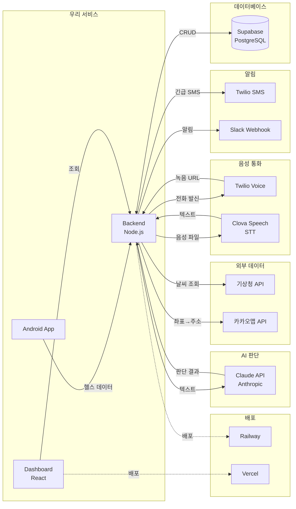

# 외부 플랫폼 연동 맵

> Hero 서비스에서 사용하는 모든 외부 플랫폼/API 정리.
> 우리 코드가 아닌 것 = 전부 여기에.

---

## 전체 데이터 흐름



---

## 플랫폼별 상세

### 1. Supabase (데이터베이스)

| 항목 | 내용 |
|---|---|
| **역할** | PostgreSQL 관리형 DB + 인증 |
| **파일** | `backend/src/db/supabase.ts` |
| **함수** | `createClient(url, key)` → 전역 `supabase` 객체 |
| **Input** | SQL 쿼리 (insert, select, update) |
| **Output** | 쿼리 결과 (JSON) |
| **환경변수** | `SUPABASE_URL`, `SUPABASE_SERVICE_ROLE_KEY` |
| **요금** | 무료 (500MB, 50K 요청/월) |
| **콘솔** | https://supabase.com/dashboard |

**사용처:**
- 모든 API에서 데이터 저장/조회
- users, health_data, alerts, call_logs, notification_logs, guardians 테이블

---

### 2. Twilio Voice (전화 발신)

| 항목 | 내용 |
|---|---|
| **역할** | 어르신에게 AI 전화 발신 + 보건소 자동 콜 |
| **파일** | `backend/src/ai-call/twilio.ts` |
| **함수** | `makeCall(toPhone, userId, eventType)` |
| | `callHealthCenter(userName, eventType, location)` |
| **Input** | 전화번호, TwiML(음성 스크립트), 콜백 URL |
| **Output** | Call SID (통화 식별자) |
| **환경변수** | `TWILIO_ACCOUNT_SID`, `TWILIO_AUTH_TOKEN`, `TWILIO_PHONE_NUMBER` |
| **요금** | 한국 발신 ~$0.14/분 |
| **콘솔** | https://console.twilio.com |

**동작 흐름:**
```
makeCall() → Twilio 서버가 전화 발신
         → 어르신 수화기 듦
         → /twilio/voice-response 에서 TwiML 읽음 (TTS 안내 + 녹음)
         → 녹음 완료 시 /twilio/recording 콜백 호출
         → 통화 종료 시 /twilio/voice-status 콜백 호출
```

---

### 3. Twilio SMS (문자 발송)

| 항목 | 내용 |
|---|---|
| **역할** | 보건소 담당자 + 보호자에게 긴급 문자 |
| **파일** | `backend/src/notify/sms.ts` |
| **함수** | `sendSMS(to, body)` |
| **Input** | 수신 번호, 메시지 본문 |
| **Output** | Message SID |
| **환경변수** | (Twilio Voice와 동일 계정) |
| **요금** | 한국 SMS ~$0.07/건 |

---

### 4. Clova Speech (음성→텍스트)

| 항목 | 내용 |
|---|---|
| **역할** | 어르신 통화 녹음을 한국어 텍스트로 변환 |
| **파일** | `backend/src/ai-call/stt.ts` |
| **함수** | `transcribe(recordingUrl)` |
| **Input** | 녹음 파일 URL (Twilio에서 제공) |
| **Output** | `{ text: "괜찮아요", confidence: 0.95 }` |
| **환경변수** | `CLOVA_SPEECH_INVOKE_URL`, `CLOVA_SPEECH_SECRET` |
| **요금** | 음성 인식 시간 기준 과금 (~$0.01/15초) |
| **콘솔** | https://console.ncloud.com → AI·NAVER API → Clova Speech |

**API 호출:**
```
POST {INVOKE_URL}
Header: X-CLOVASPEECH-API-KEY: {SECRET}
Body: { url: "녹음URL", language: "ko-KR", completion: "sync" }
Response: { segments: [{ text: "괜찮아요", confidence: 0.95 }] }
```

---

### 5. Claude API (AI 의도 판단)

| 항목 | 내용 |
|---|---|
| **역할** | STT 텍스트 분석 → safe / emergency / unclear 분류 |
| **파일** | `backend/src/ai-call/classify.ts` |
| **함수** | `classifyResponse(sttText)` |
| **Input** | 어르신 발화 텍스트 (예: "아파요 못 일어나") |
| **Output** | `{ classification: "emergency", reasoning: "통증 호소 + 거동 불가" }` |
| **환경변수** | `ANTHROPIC_API_KEY` |
| **모델** | claude-sonnet-4-20250514 |
| **요금** | 입력 $3/1M tokens, 출력 $15/1M tokens |
| **콘솔** | https://console.anthropic.com |

**프롬프트 구조:**
```
System: 분류 기준 + 규칙 (safe/emergency/unclear 정의)
User: 어르신 응답: "{sttText}"
Response: JSON { classification, reasoning }
```

---

### 6. Slack Incoming Webhook (팀 알림)

| 항목 | 내용 |
|---|---|
| **역할** | 응급 상황 발생 시 Slack 채널에 알림 |
| **파일** | `backend/src/notify/slack.ts` |
| **함수** | `sendSlack(message, context)` |
| **Input** | 알림 메시지 + 컨텍스트 (userId, eventType, lat, lng) |
| **Output** | 200 OK (성공 시) |
| **환경변수** | `SLACK_WEBHOOK_URL` |
| **요금** | 무료 |
| **콘솔** | https://api.slack.com/apps |

**발송 형식:** Block Kit (헤더 + 본문 + 필드 그리드)

---

### 7. 기상청 초단기실황 API (날씨)

| 항목 | 내용 |
|---|---|
| **역할** | 현재 기온/습도 조회 → 체감온도 계산 → 감지 로직 가중치 |
| **파일** | `backend/src/external/weather.ts` |
| **함수** | `checkWeather(lat, lng)` |
| | `applyWeatherWeight(userId, lat, lng)` |
| **Input** | GPS 위경도 → 격자 좌표(nx, ny)로 변환 |
| **Output** | `{ temperature: 35, humidity: 70, feelsLike: 41.2 }` |
| **환경변수** | `KMA_API_KEY` |
| **요금** | 무료 |
| **콘솔** | https://www.data.go.kr |

**API 호출:**
```
GET http://apis.data.go.kr/1360000/VilageFcstInfoService_2.0/getUltraSrtNcst
Params: serviceKey, base_date, base_time, nx, ny
Response: items[] → T1H(기온), REH(습도)
```

**체감온도 33°C 이상 → 관찰 윈도우 2분→1분 단축**

---

### 8. 카카오맵 API (좌표→주소)

| 항목 | 내용 |
|---|---|
| **역할** | GPS 좌표를 사람이 읽을 수 있는 주소로 변환 |
| **파일** | `backend/src/external/kakao-map.ts` |
| **함수** | `coordToAddress(lat, lng)` |
| **Input** | 위도, 경도 |
| **Output** | `{ address: "경북 청도군 각남면 다로리", roadAddress: null }` |
| **환경변수** | `KAKAO_MAP_API_KEY` |
| **요금** | 무료 (30만건/일) |
| **콘솔** | https://developers.kakao.com |

**API 호출:**
```
GET https://dapi.kakao.com/v2/local/geo/coord2address.json
Header: Authorization: KakaoAK {API_KEY}
Params: x(경도), y(위도)
Response: documents[0].address.address_name
```

---

### 9. Railway (백엔드 배포)

| 항목 | 내용 |
|---|---|
| **역할** | Node.js 백엔드 서버 호스팅 |
| **대상** | `/backend` 폴더 |
| **자동 배포** | GitHub push → 자동 빌드+배포 |
| **도메인** | `https://your-app.up.railway.app` |
| **요금** | 무료 ($5 크레딧/월) |
| **콘솔** | https://railway.app/dashboard |

---

### 10. Vercel (프론트 배포)

| 항목 | 내용 |
|---|---|
| **역할** | React 대시보드 정적 호스팅 |
| **대상** | `/dashboard` 폴더 |
| **자동 배포** | GitHub push → 자동 빌드+배포 |
| **도메인** | `https://your-dashboard.vercel.app` |
| **요금** | 무료 |
| **콘솔** | https://vercel.com/dashboard |

---

## 호출 순서 시각화 (이상 감지 → 보건소 알림까지)

```
시간순서 →

[Android App]
    │ POST /health (심박 130bpm, 걸음수 0)
    ▼
[Backend: detection/engine.ts]
    │ processHealthData() → 상태: observing → alert
    ▼
[Backend: ai-call/trigger.ts]
    │ triggerAICall()
    ▼
[Twilio Voice]  ←── makeCall() ──── twilio.ts
    │ 어르신 전화 울림 → 수화기 듦
    │ TwiML 실행: TTS 안내 + 녹음
    ▼
[Twilio 녹음 완료 콜백]
    │ POST /twilio/recording (recordingUrl)
    ▼
[Clova Speech]  ←── transcribe() ──── stt.ts
    │ 녹음 URL → "아파요 못 일어나"
    ▼
[Claude API]  ←── classifyResponse() ──── classify.ts
    │ "아파요 못 일어나" → { classification: "emergency" }
    ▼
[Backend: notify/emergency.ts]
    │ notifyEmergency()
    ├──→ [Twilio SMS] ── sendSMS() → 보건소 + 보호자
    ├──→ [Slack] ── sendSlack() → #hero-alerts 채널
    ├──→ [Twilio Voice] ── callHealthCenter() → 보건소 자동 콜
    └──→ [카카오맵] ── coordToAddress() → 알림에 주소 포함

[기상청 API]  ←── checkWeather() ──── weather.ts
    (감지 로직 실행 시 병렬 호출, 33°C↑이면 관찰 시간 단축)
```

---

## 환경변수 ↔ 플랫폼 매핑 요약

| 환경변수 | 플랫폼 | 용도 |
|---|---|---|
| `SUPABASE_URL` | Supabase | DB 연결 |
| `SUPABASE_SERVICE_ROLE_KEY` | Supabase | DB 인증 |
| `TWILIO_ACCOUNT_SID` | Twilio | 계정 식별 |
| `TWILIO_AUTH_TOKEN` | Twilio | 인증 |
| `TWILIO_PHONE_NUMBER` | Twilio | 발신 번호 |
| `HEALTH_CENTER_PHONE` | (우리가 입력) | 보건소 번호 |
| `CLOVA_SPEECH_INVOKE_URL` | Naver Cloud | STT 엔드포인트 |
| `CLOVA_SPEECH_SECRET` | Naver Cloud | STT 인증 |
| `ANTHROPIC_API_KEY` | Anthropic | Claude 인증 |
| `SLACK_WEBHOOK_URL` | Slack | 웹훅 URL |
| `KMA_API_KEY` | 공공데이터포털 | 기상청 인증 |
| `KAKAO_MAP_API_KEY` | Kakao Developers | 지도 API 인증 |
| `BASE_URL` | Railway | Twilio 콜백 URL |
| `REACT_APP_API_URL` | (대시보드용) | 백엔드 주소 |

---

## 참고: Gemini / OpenAI는 안 씀

현재 프로젝트에서는 **Gemini, OpenAI(GPT) 사용하지 않음**.
AI 판단은 Claude(Anthropic)으로 통일. 이유:
- 한국어 이해도 높음
- JSON 구조화 출력 안정적
- 요금 합리적 (Sonnet 기준)
